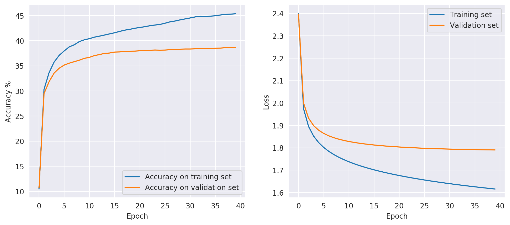
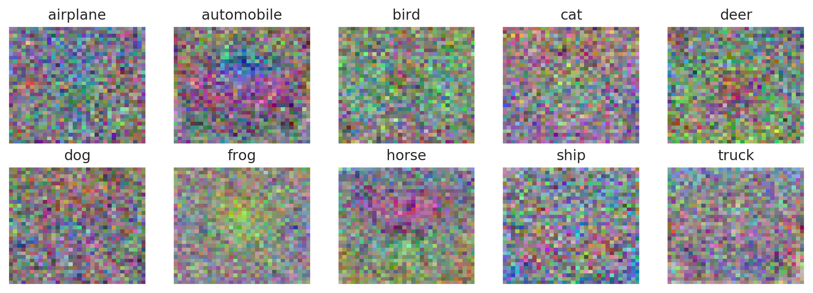
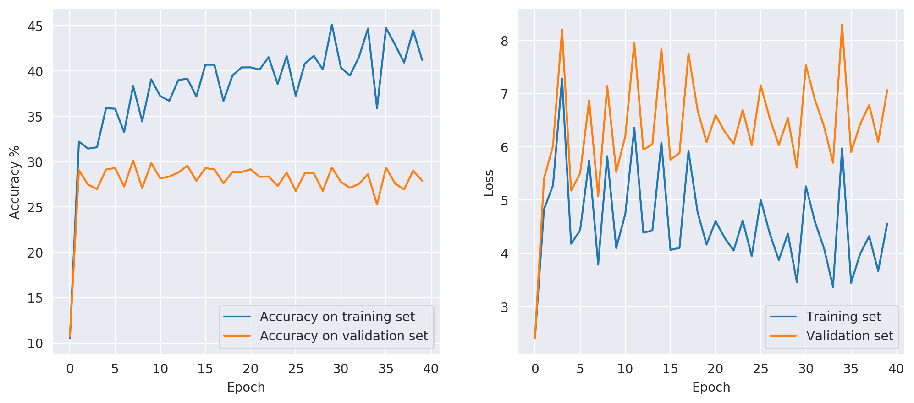
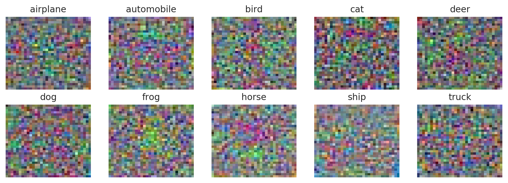
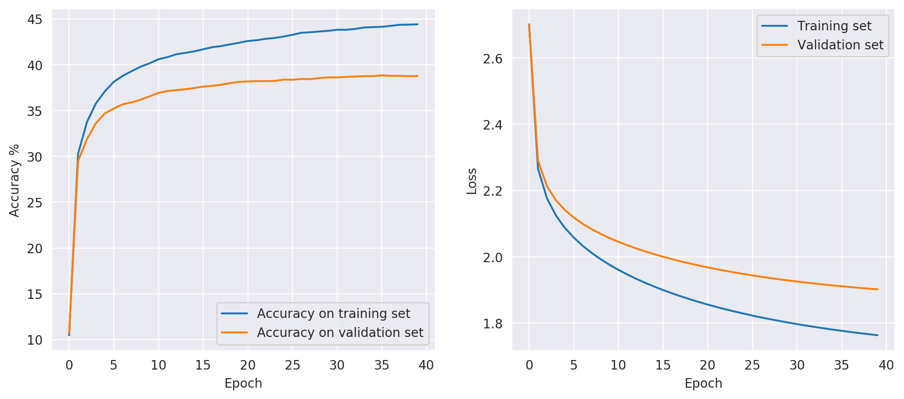
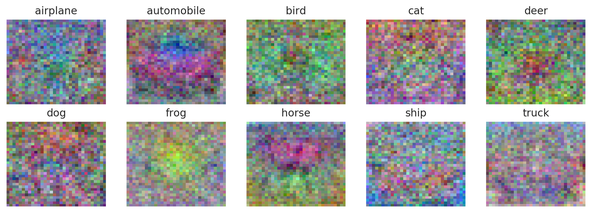
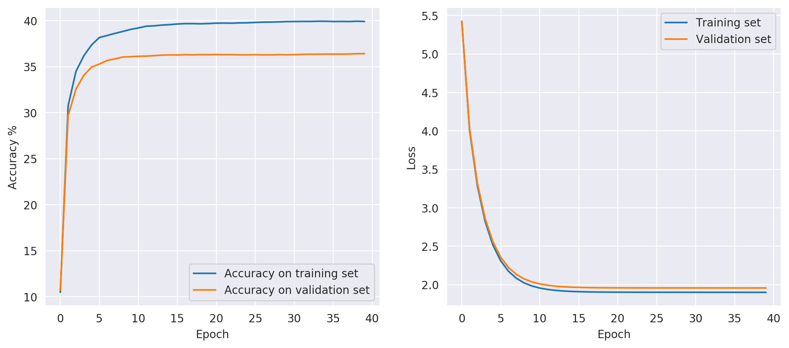
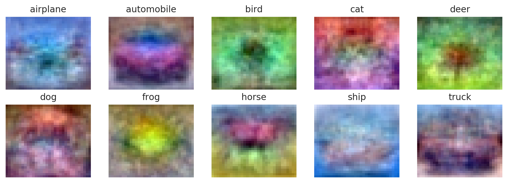

# DD2424 Deep Learning in Data Science - Assignment 1


## Introduction
The goal of this assignment is to train and evaluate a single layer neural network in order to
classify images from the [CIFAR-10](https://www.cs.toronto.edu/~kriz/cifar.html) dataset.


## Computing the gradient

A analytical approach is used to compute the gradients of the weights and bias. While it is relatively efficient to compute, it is less accurate
than gradients obtained via numerical methods. Because of this one has to first verify that the difference between the two approaches is relatively small.
The relative error is defined as <p align="center"></p>
Where  is the analytically computed gradient and  is the numerically computed gradient and  is a very small positive number.

A comparison is therefore made between the analytical gradient and the gradients computed with the *Finite* and *Central-*difference methods, respectively.
The results are shown in the table below,


| Gradient                       | Relative Error         |   Mean Weight |   Min Weight |   Max Weight |
|--------------------------------|------------------------|---------------|--------------|--------------|
| Analytical                     | -                      |   2.77556e-18 |    -0.301867 |     0.329779 |
| Finite difference (Numerical)  | 3.760843125266874e-07  |   4.26082e-08 |    -0.301867 |     0.329779 |
| Central difference (Numerical) | 1.4283217134655148e-09 |  -1.73473e-13 |    -0.301867 |     0.329779 |


From the table above, it is clear that the analytical gradient is sufficiently close to the numerical ones. 
Thus we may continue with the evaluation of the single layer neural network, knowing that the gradient used to train the network
is accurate.

## The result from minimizing the cross-entropy loss function

The network was then trained using different values for regularization and mini-batch gradient descent.
Below are the results from a few models trained with different learning rates  and regularization parameters .


```
Model parameters:
   loss:        cross
   lambda:      0
   eta:         0.001
   n_epochs:    40
   n_batches:   100
   shuffle:     False

Training data:
   accuracy (untrained):        10.48%
   accuracy (trained):          45.37%
   cost (final):                1.62
Validation data:
   accuracy (untrained):        10.71%
   accuracy (trained):          38.65%
   cost (final):                1.79
Test data:
   accuracy (untrained):        10.85%
   accuracy (trained):          38.86%
   cost (final):                1.76
```

\



```
Model parameters:
   loss:        cross
   lambda:      0
   eta:         0.1
   n_epochs:    40
   n_batches:   100
   shuffle:     False

Training data:
   accuracy (untrained):        10.48%
   accuracy (trained):          41.21%
   cost (final):                4.56
Validation data:
   accuracy (untrained):        10.71%
   accuracy (trained):          27.89%
   cost (final):                7.07
Test data:
   accuracy (untrained):        10.85%
   accuracy (trained):          28.70%
   cost (final):                6.95
```

\



```
Model parameters:
   loss:        cross
   lambda:      0.1
   eta:         0.001
   n_epochs:    40
   n_batches:   100
   shuffle:     False

Training data:
   accuracy (untrained):        10.48%
   accuracy (trained):          44.41%
   cost (final):                1.76
Validation data:
   accuracy (untrained):        10.71%
   accuracy (trained):          38.77%
   cost (final):                1.90
Test data:
   accuracy (untrained):        10.85%
   accuracy (trained):          39.01%
   cost (final):                1.88
```

\



```
Model parameters:
   loss:        cross
   lambda:      1
   eta:         0.001
   n_epochs:    40
   n_batches:   100
   shuffle:     False

Training data:
   accuracy (untrained):        10.48%
   accuracy (trained):          39.91%
   cost (final):                1.90
Validation data:
   accuracy (untrained):        10.71%
   accuracy (trained):          36.41%
   cost (final):                1.96
Test data:
   accuracy (untrained):        10.85%
   accuracy (trained):          37.50%
   cost (final):                1.94
```

\



## The effect of regularization and learning rate

The parameter  controls the degree of the regularization in the model.
The regularization adds a penalty term to the cost function. Because the objective is to minimize the
cost function, the regularization will effectively penalize the function for large weights. 
This will force the weights closer to zero, resulting in a simpler network which is slightly underfitted 
to the training data. Since regularization helps with overfitting, a model with regularization should generalize
better to new data.


The learning rate  controls how quickly the model adjusts to the data. It is the 'step size' when updating the 
weights and bias. As such, a smaller  requires more training epochs for the model to converge, while a larger learning 
rate results in a faster convergence in fewer training epochs. However, a learning rate that is too large may cause the model to 
very quickly adapt to a suboptimal solution or to oscillate rather violently around what would be the converged solution.
It is therefore important that one takes the time to finely tune the learning rate in order to get a model that behaves and performs well.  


