# DD2424 Deep Learning in Data Science - Assignment 1


## Introduction
The goal of this assignment is to train and evaluate the performance of a *single layer neural network* in order to
classify images from the [CIFAR-10](https://www.cs.toronto.edu/~kriz/cifar.html) dataset.

Here is a sample from the data set of the images that we'll attempt to classify.

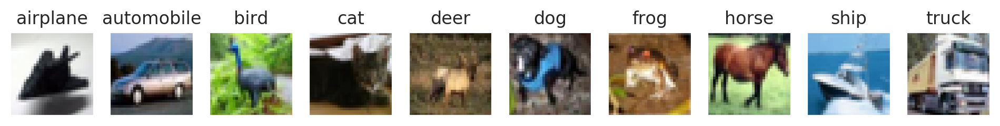


In the first part of the assignment we'll use the cross-entropy loss as our cost function which we'll try to minimize.
The cross-entropy is basically a measure that tells us the difference between what the model thinks that the output (class)
distribution should be, and what the actual distribution of the classes are in the data set. The minimization of the loss is done using
mini-batch gradient descent which requires us to calculate the gradients of the cost function. 

## Computing the gradient

A analytical approach is used to compute the gradients of the weights and bias. While it is relatively efficient to compute, it is less accurate
than gradients obtained via numerical methods. Because of this one has to first verify that the difference between the two approaches is relatively small.
The relative error between the analytical and numerical gradient is defined as <p align="center"></p>


A comparison is then made between the analytical gradient and the gradients computed with the *Finite* and *Central-*difference methods, respectively.
The results are shown in the table below,


| Gradient                       | Relative Error   |   Mean Weight |   Min Weight |   Max Weight |
|--------------------------------|------------------|---------------|--------------|--------------|
| Analytical                     | -                |   2.77556e-18 |    -0.301867 |     0.329779 |
| Finite difference (Numerical)  | 3.76084e-07      |   4.26082e-08 |    -0.301867 |     0.329779 |
| Central difference (Numerical) | 1.42832e-09      |  -1.73473e-13 |    -0.301867 |     0.329779 |


From the table above, it is clear that the analytical gradient is sufficiently close to the numerical ones. 
Thus we may continue with the evaluation of the single layer neural network, knowing that the gradient used to train the network
is accurate.

## The result from minimizing the cross-entropy loss function

The network was then trained using different values for regularization and mini-batch gradient descent.
Below are the results from a few models trained with different learning rates  and regularization parameters .


**Model 1**

```
Model parameters:
   loss:        cross
   lambda:      0
   eta:         0.1
   n_epochs:    40
   n_batches:   100

Training data:
   accuracy (untrained):        10.48%
   accuracy (trained):          41.21%
   cost (final):                4.56
Validation data:
   accuracy (untrained):        10.71%
   accuracy (trained):          27.89%
   cost (final):                7.07
Test data:
   accuracy (untrained):        10.85%
   accuracy (trained):          28.70%
   cost (final):                6.95
```

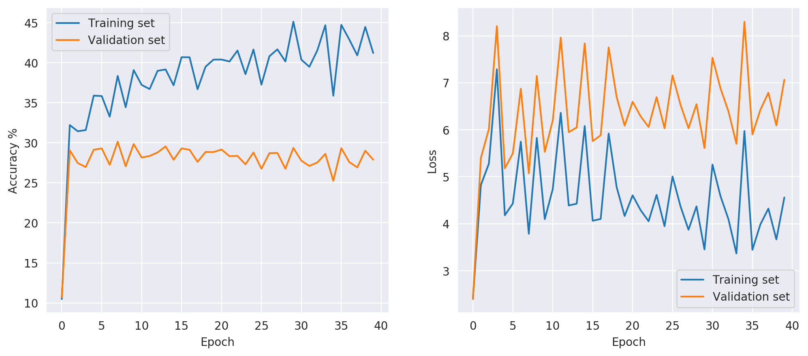\
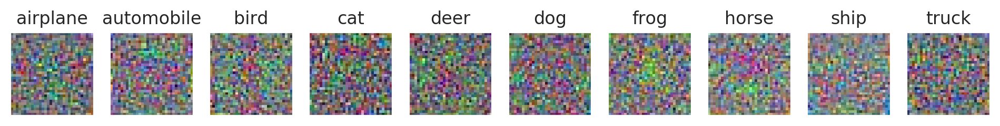

The small images above represents the weights or the 'image templates' for each class that the model
has learned during training. Now we'll make some small adjustments to the model parameters and observe the results. 


**Model 2** - Decrease the learning rate

```
Model parameters:
   loss:        cross
   lambda:      0
   eta:         0.001
   n_epochs:    40
   n_batches:   100

Training data:
   accuracy (untrained):        10.48%
   accuracy (trained):          45.37%
   cost (final):                1.62
Validation data:
   accuracy (untrained):        10.71%
   accuracy (trained):          38.65%
   cost (final):                1.79
Test data:
   accuracy (untrained):        10.85%
   accuracy (trained):          38.86%
   cost (final):                1.76
```

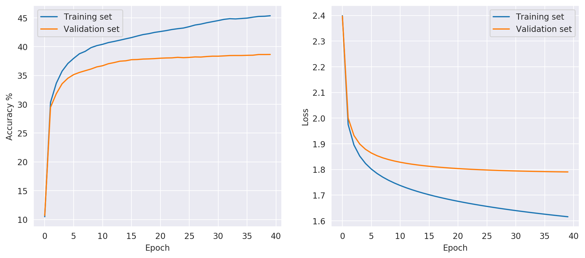\
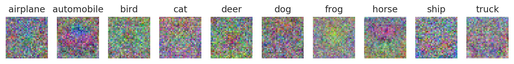


**Model 3** - Add regularization to the loss function

```
Model parameters:
   loss:        cross
   lambda:      0.1
   eta:         0.001
   n_epochs:    40
   n_batches:   100

Training data:
   accuracy (untrained):        10.48%
   accuracy (trained):          44.41%
   cost (final):                1.76
Validation data:
   accuracy (untrained):        10.71%
   accuracy (trained):          38.77%
   cost (final):                1.90
Test data:
   accuracy (untrained):        10.85%
   accuracy (trained):          39.01%
   cost (final):                1.88
```

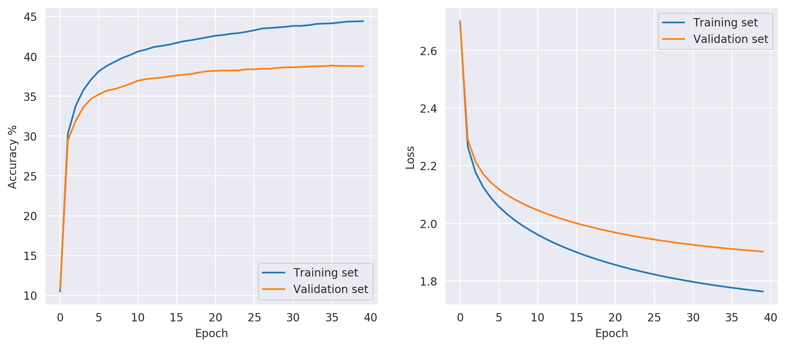\
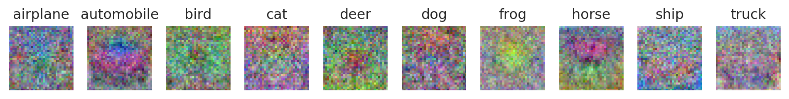


**Model 4** - Further increase of the regularization

```
Model parameters:
   loss:        cross
   lambda:      1
   eta:         0.001
   n_epochs:    40
   n_batches:   100

Training data:
   accuracy (untrained):        10.48%
   accuracy (trained):          39.91%
   cost (final):                1.90
Validation data:
   accuracy (untrained):        10.71%
   accuracy (trained):          36.41%
   cost (final):                1.96
Test data:
   accuracy (untrained):        10.85%
   accuracy (trained):          37.50%
   cost (final):                1.94
```

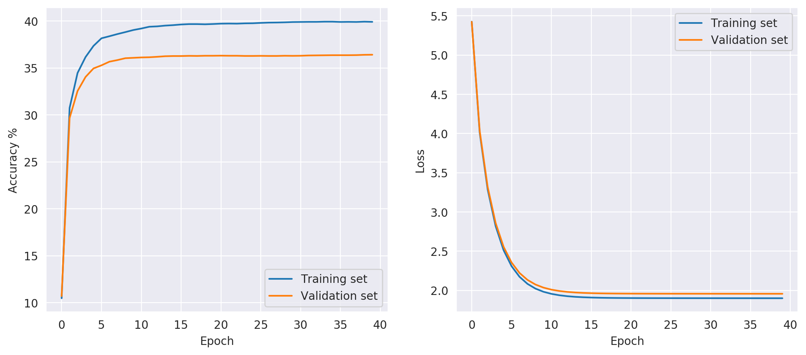\
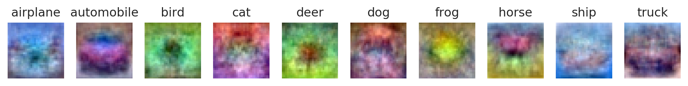


## The effect of regularization and learning rate

Regularization adds a penalty term to the cost function, where the parameter  is used to control the degree 
of the regularization in the model. Because the objective is to minimize the cost function, the regularization will effectively
penalize the function for large weights. This will force the weights closer to zero, resulting in a simpler network which is slightly underfitted 
to the training data. Since regularization helps with overfitting, a model with regularization should generalize
better to new data. This can be seen in the graphs produced earlier where the gap between the training and validation accuracy is larger when
there is no regularization used compared to the cases when it is used.


The learning rate  controls how quickly the model adjusts to the data. It is basically the 'step size' used when calculating the 
new weights and bias in each epoch. As such, a smaller  will require more training epochs for the model to converge, while a larger learning 
rate results in a faster convergence in fewer training epochs. However, a learning rate that is too large may cause the model to 
very quickly adapt to a suboptimal solution or may cause it ti oscillate rather violently around what would be the converged solution.
It is therefore important that one takes the time to finely tune the learning rate in order to get a model that behaves and performs well.  


## Optimize the performance of the network
Now we make some changes to see if we can increase the performance of the network. There are many possible options
to consider but I will mainly focus on

* Add some decay to the learning rate parameter after each epoch
* Train for a longer time
* Shuffle the order of the training data batch in the beginning of each epoch
* Add geometric and photometric jitter to the training samples

The results from these attempts are then compared to the currently best performing configuration (Model 3),
which has a 39.01% prediction accuracy on the test data. 


### Adding decay to the learning rate
The parameters used to train this model are kept constant and identical to model 3 while introducing a decay rate
to the learning rate. The rate of decay is set to 0.95, meaning that the learning rate decays by 5% in each epoch.

```
Model parameters:
   loss:        cross
   lambda:      0.1
   eta:         0.01
   n_epochs:    40
   n_batches:   100
   decay:       0.95

Training data:
   accuracy (untrained):        10.48%
   accuracy (trained):          46.43%
   cost (final):                1.69
Validation data:
   accuracy (untrained):        10.71%
   accuracy (trained):          39.01%
   cost (final):                1.86
Test data:
   accuracy (untrained):        10.85%
   accuracy (trained):          39.33%
   cost (final):                1.84
```

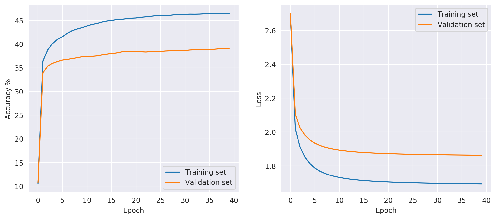\
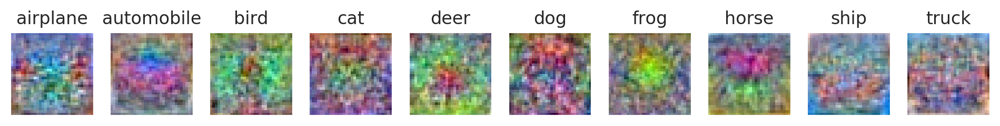

This gave a small performance boost, an increase with 0.32 percentage points of the accuracy
on the test data, relative to model 3.

### Train for a longer time

Take the best performing model (3) and increase the number of training epochs from 40 to 500.

```
Model parameters:
   loss:        cross
   lambda:      0.1
   eta:         0.001
   n_epochs:    500
   n_batches:   100

Training data:
   accuracy (untrained):        10.48%
   accuracy (trained):          46.46%
   cost (final):                1.69
Validation data:
   accuracy (untrained):        10.71%
   accuracy (trained):          38.93%
   cost (final):                1.86
Test data:
   accuracy (untrained):        10.85%
   accuracy (trained):          39.55%
   cost (final):                1.84
```

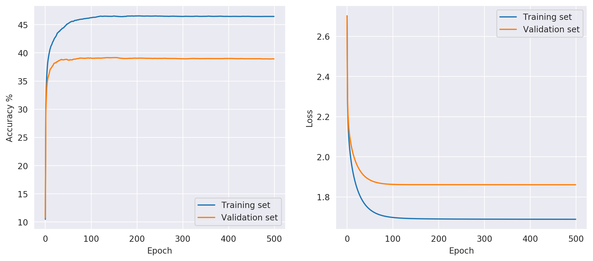\
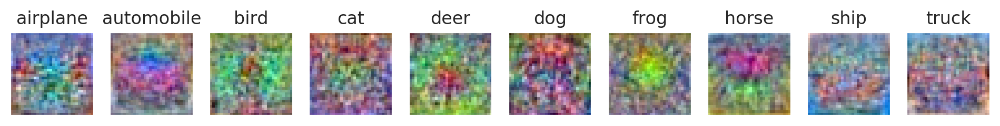

This also gave a slightly larger performance boost, about 0.54 percentage point increase of the accuracy on the
test data, relative to model 3.

### Shuffle the training data

The parameters used to train this model are kept constant and identical to model 3 while introducing shuffling of the training data
at each epoch.

```
Model parameters:
   loss:        cross
   lambda:      0.1
   eta:         0.001
   n_epochs:    40
   n_batches:   100
   shuffle:     True

Training data:
   accuracy (untrained):        10.48%
   accuracy (trained):          44.76%
   cost (final):                1.76
Validation data:
   accuracy (untrained):        10.71%
   accuracy (trained):          39.06%
   cost (final):                1.90
Test data:
   accuracy (untrained):        10.85%
   accuracy (trained):          39.23%
   cost (final):                1.88
```

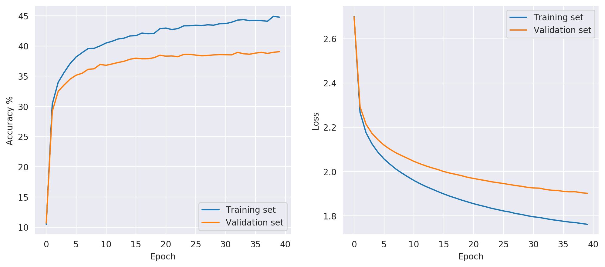\
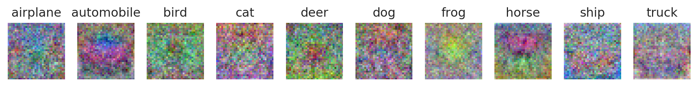

Shuffling the training data at each epoch gave a slight performance boost, 0.22 percentage point increase in accuracy on test data 
relative to model 3.

### Add noise to training data
By adding noise to the data will make it more difficult for the network to make a precise fit
to the training data and will therefore reduce the risk of overfitting the model.
As such, we should see similar results between a model that is trained with L2 regularization and 
a model that has no L2 regularization but has noise added to the training data.


Now adding gaussian noise with mean 0 and standard deviation 0.01 to the training batches.
Here's an example of what this does to the images.

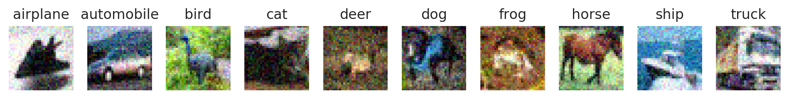


The result when adding gaussian noise to the training data.

```
Model parameters:
   loss:        cross
   lambda:      0.0
   eta:         0.001
   n_epochs:    40
   n_batches:   100
   noise:       gaussian

Training data:
   accuracy (untrained):        10.48%
   accuracy (trained):          43.66%
   cost (final):                1.67
Validation data:
   accuracy (untrained):        10.71%
   accuracy (trained):          38.21%
   cost (final):                1.84
Test data:
   accuracy (untrained):        10.85%
   accuracy (trained):          38.46%
   cost (final):                1.81
```

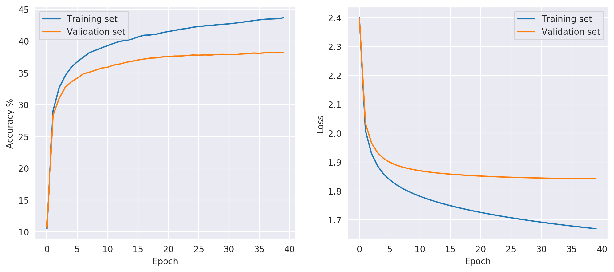\
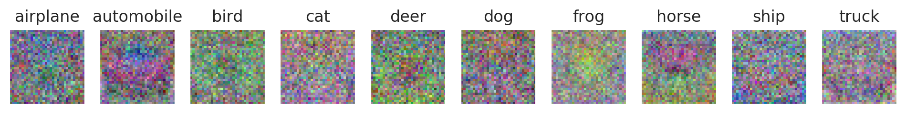


Now we also try to add some salt&pepper noise to the training batches. This will randomly set some pixels to either 0 or 1.
Here's an example of what this does to the images.

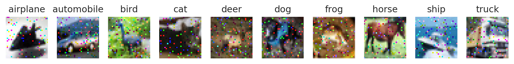

This is the result when training with salt&pepper noise.

```
Model parameters:
   loss:        cross
   lambda:      0.0
   eta:         0.001
   n_epochs:    40
   n_batches:   100
   noise:       s&p

Training data:
   accuracy (untrained):        10.48%
   accuracy (trained):          43.31%
   cost (final):                1.68
Validation data:
   accuracy (untrained):        10.71%
   accuracy (trained):          38.12%
   cost (final):                1.86
Test data:
   accuracy (untrained):        10.85%
   accuracy (trained):          38.51%
   cost (final):                1.82
```

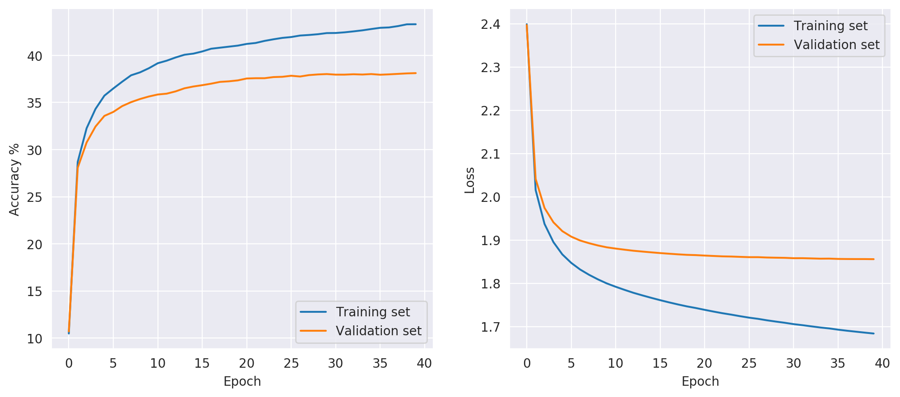\


The models trained with noise added and no regularization showed similar results in terms of the accuracies on
the test and training data as models that has some regularization introduced.


Now using what we've learned, we'll combine some of the tricks from above and tune our hyperparameters to see 
if we can get even better performance. We'll train the model for a longer time and add a decay to the learning rate.
After some trial and error with the parameter values, the best performing model was chosen as


```
Model parameters:
   loss:        cross
   lambda:      0.1
   eta:         0.04
   n_epochs:    100
   n_batches:   500
   decay:       0.95

Training data:
   accuracy (untrained):        10.48%
   accuracy (trained):          46.41%
   cost (final):                1.69
Validation data:
   accuracy (untrained):        10.71%
   accuracy (trained):          39.27%
   cost (final):                1.86
Test data:
   accuracy (untrained):        10.85%
   accuracy (trained):          39.89%
   cost (final):                1.83
```

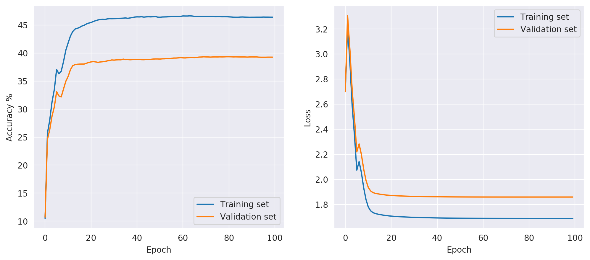\
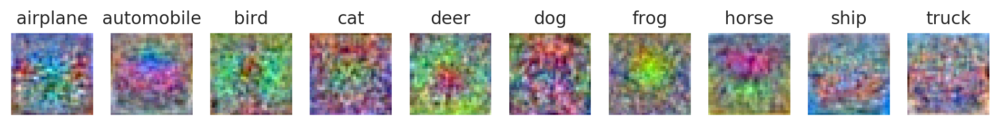

Where the best accuracy obtained on the test data is 39.89%.


## Train the network by minimizing the SVM multi-class loss

The SVM multi-class loss function with L2 regularization is given by


<p align="center"></p>

Where  is the score function.
Once the methods for calculating the loss function and the corresponding gradients have been implemented we're ready to test the model.
The same parameters are used as when the minimization was done with respect to the cross-entropy loss function in order to make a comparison
between the two approaches. The figures below show the results obtained.


**Model 1**

```
Model parameters:
   loss:        svm
   lambda:      0
   eta:         0.1
   n_epochs:    40
   n_batches:   100

Training data:
   accuracy (untrained):        10.48%
   accuracy (trained):          42.80%
   cost (final):                15.97
Validation data:
   accuracy (untrained):        10.71%
   accuracy (trained):          29.14%
   cost (final):                41.90
Test data:
   accuracy (untrained):        10.85%
   accuracy (trained):          30.04%
   cost (final):                41.43
```

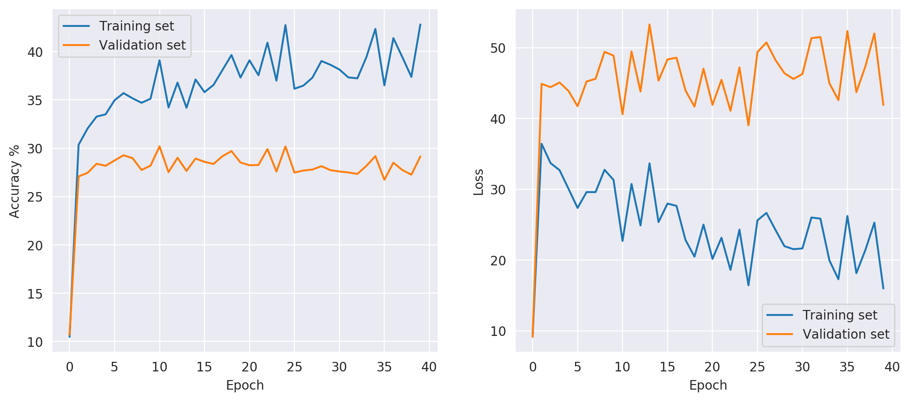\
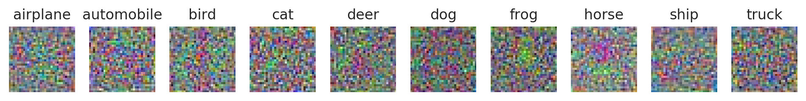


**Model 2** - Decrease the learning rate

```
Model parameters:
   loss:        svm
   lambda:      0
   eta:         0.001
   n_epochs:    40
   n_batches:   100

Training data:
   accuracy (untrained):        10.48%
   accuracy (trained):          48.26%
   cost (final):                3.00
Validation data:
   accuracy (untrained):        10.71%
   accuracy (trained):          34.84%
   cost (final):                4.91
Test data:
   accuracy (untrained):        10.85%
   accuracy (trained):          35.35%
   cost (final):                4.86
```

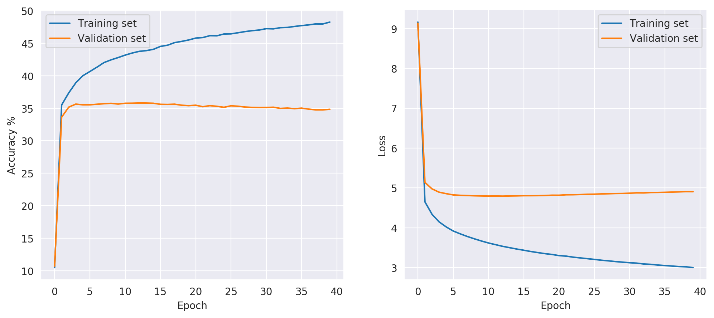\
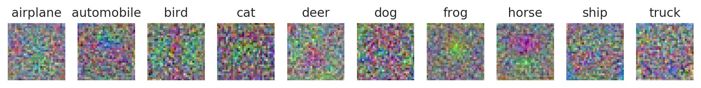


**Model 3** - Add regularization to the loss function

```
Model parameters:
   loss:        svm
   lambda:      0.1
   eta:         0.001
   n_epochs:    40
   n_batches:   100

Training data:
   accuracy (untrained):        10.48%
   accuracy (trained):          47.64%
   cost (final):                3.33
Validation data:
   accuracy (untrained):        10.71%
   accuracy (trained):          35.21%
   cost (final):                5.07
Test data:
   accuracy (untrained):        10.85%
   accuracy (trained):          35.78%
   cost (final):                5.01
```

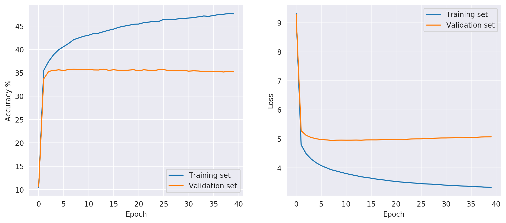\
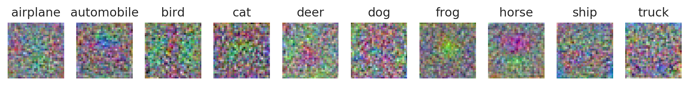


**Model 4** - Further increase of the regularization

```
Model parameters:
   loss:        svm
   lambda:      1
   eta:         0.001
   n_epochs:    40
   n_batches:   100

Training data:
   accuracy (untrained):        10.48%
   accuracy (trained):          43.37%
   cost (final):                4.08
Validation data:
   accuracy (untrained):        10.71%
   accuracy (trained):          36.24%
   cost (final):                5.14
Test data:
   accuracy (untrained):        10.85%
   accuracy (trained):          36.62%
   cost (final):                5.06
```

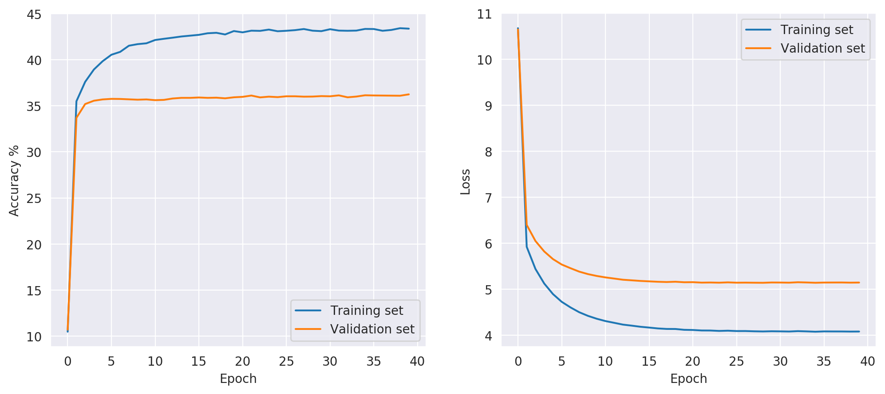\
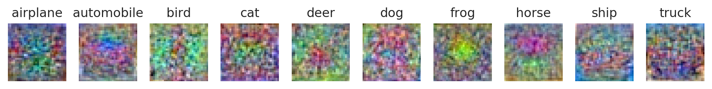


The final accuracy on the test data for the chosen parameters and the two different loss-functions are shown in the tables below.

|     loss       |      |        |  Epochs     |   Batches       | Accuracy on test data |
|----------------|---------------|--------------|-------------|-----------------|-----------------------|
|     cross      |      0.0      |     0.1      |      40     |       100       |        28.70%         |
|   **cross**    |    **0.0**    |  **0.001**   |    **40**   |     **100**     |      **38.86%**       |
|   **cross**    |    **0.1**    |  **0.001**   |    **40**   |     **100**     |      **39.01%**       |
|   **cross**    |    **1.0**    |  **0.001**   |    **40**   |     **100**     |      **37.50%**       |


|     loss       |  |    |  Epochs  |   Batches   | Accuracy on test data |
|----------------|-----------|----------|----------|-------------|-----------------------|
|   **svm**      |  **0.0**  | **0.1**  |  **40**  |   **100**   |      **30.04%**       |
|     svm        |    0.0    |  0.001   |    40    |     100     |        35.35%         |
|     svm        |    0.1    |  0.001   |    40    |     100     |        35.78%         |
|     svm        |    1.0    |  0.001   |    40    |     100     |        36.62%         |


## Conclusions
Comparing the performance of the model when minimizing the SVM multi-class loss vs the cross-entropy loss we can draw some conclusions. 
The svm-models 1,2 and 3 seem to suffer from overfitting as the accuracy on the training set continues to increase while it has leveled
out for the validation set. As such they seem to require more aggressive regularization than the cross-entropy loss models in order to avoid overfitting.
It is also clear from the table above that the prediction accuracies on the test data are slightly lower for the svm-models, by about 1-2 percentage points, 
relative to the cross-entropy counterparts. This can likely be addressed by fine-tuning the parameters for the svm loss, which should allow those models to 
perform approximately the same as the models that minimize the cross-entropy loss. All things considered I think the cross-entropy loss is the better alternative 
due to the slight performance advantage and because the gradient is easy to implement and efficient to compute.
