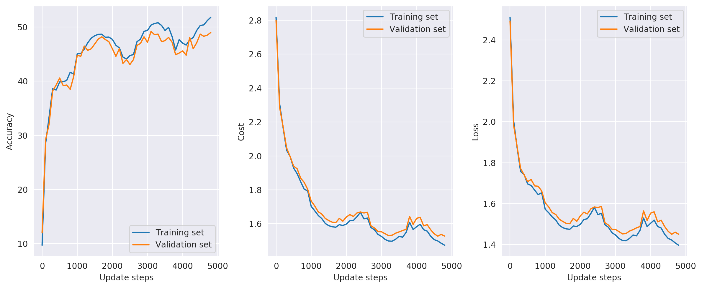
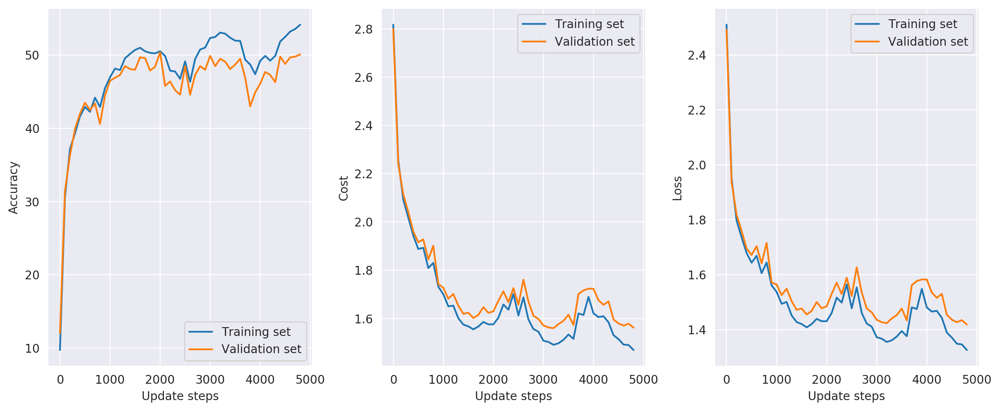
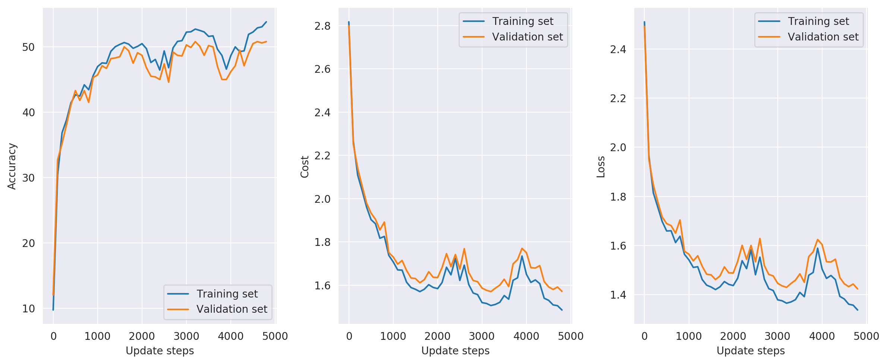

# DD2424 Deep Learning in Data Science - Assignment 2


## Introduction
The goal of this assignment is to train and evaluate the performance of a *multi layer neural network* in order to
classify images from the [CIFAR-10](https://www.cs.toronto.edu/~kriz/cifar.html) dataset.


## Computing the gradient

Before continuing we first have to verify that the gradients computed are sufficiently accurate. A comparsion will therefore be made between
the analytically computed gradients and the corresponding gradients computed numerically, for each layer in the network.
Because it is computationally expensive to compute the cost for all entries in the weight matrices using the numerical methods we'll reduce the number of images and their dimensionality when computing the gradients for this comparison.
The dimensionality of the images are brought down from 3072 to 1000. We're also only using 20 samples and the tolerance is set to 1e-5.

The relative error between the analytical gradient and the gradients computed with the *Finite* and *Central-*difference methods are shown in the table below,


|   Layer # |   Relative error Analytical vs Finite Difference |   Relative error Analytical vs Centered Difference |
|-----------|--------------------------------------------------|----------------------------------------------------|
|         1 |                                      1.03671e-06 |                                        4.3755e-10  |
|         2 |                                      2.28566e-06 |                                        2.35573e-10 |


From the table above, it is clear that the analytical gradient is sufficiently close to the numerical ones. 
A quick sanity check is also done by training the model for 200 epochs with no regularization and a learning rate set to 0.01.
From this we expect the model to become very overfitted to the training data and therefore have a very low loss. The results are shown
in the figure below


Now we can be quite confident that the analytical gradient is sufficiently accurate since we're able to achieve a very overfitted model with a low loss 
and we've also verified that the differences between the analytical and numerical gradients are low. As such we'll proceed.

## Train the network on a batch of data

The network was then trained using the given parameter values.


```
Model parameters:
   layer size:  50
   lambda:      0.01
   cycles:      1
   n_s:         500
   n_batches:   100
   eta_min:     1e-05
   eta_max:     0.1

Training data:
   accuracy (untrained):        9.50%
   accuracy (trained):          59.81%
   cost (final):                1.46
Validation data:
   accuracy (untrained):        9.59%
   accuracy (trained):          44.98%
   cost (final):                1.84
Test data:
   accuracy (untrained):        9.82%
   accuracy (trained):          45.61%
   cost (final):                1.81
```


Now we'll train for 3 cycles.

```
Model parameters:
   layer size:  50
   lambda:      0.01
   cycles:      3
   n_s:         800
   n_batches:   100
   eta_min:     1e-05
   eta_max:     0.1

Training data:
   accuracy (untrained):        9.50%
   accuracy (trained):          70.36%
   cost (final):                1.29
Validation data:
   accuracy (untrained):        9.59%
   accuracy (trained):          46.23%
   cost (final):                1.90
Test data:
   accuracy (untrained):        9.82%
   accuracy (trained):          46.70%
   cost (final):                1.87
```


The cyclical pattern is clearly visible in the accuracy and loss/cost plots and overlaps with the cyclical learning rate.
It seems to work well because oscillations in the learning rate allows us to periodically take larger "steps" which may allow us
to escape from a local minima. As such, the neural network doesn't run the same risk of getting stuck at a local minima of the cost function
during the gradient descent.

### Coarse search for *good* regularization parameter values


|   lambda |   cycles |   n_s |   n_batches |   eta_min |   eta_max | accuracy (train)   | accuracy (val)   | accuracy (test)   |
|----------|----------|-------|-------------|-----------|-----------|--------------------|------------------|-------------------|
| 0.007241 |        2 |   200 |         100 |     1e-05 |       0.1 | 58.30%             | 44.71%           | 45.28%            |
| 0.012925 |        2 |   200 |         100 |     1e-05 |       0.1 | 56.49%             | 45.12%           | 45.55%            |
| 1.4e-05  |        2 |   200 |         100 |     1e-05 |       0.1 | 61.53%             | 44.21%           | 44.73%            |
| 0.002974 |        2 |   200 |         100 |     1e-05 |       0.1 | 59.97%             | 44.28%           | 45.01%            |
| 0.000153 |        2 |   200 |         100 |     1e-05 |       0.1 | 61.77%             | 43.97%           | 44.96%            |
| 0.019335 |        2 |   200 |         100 |     1e-05 |       0.1 | 54.53%             | 44.59%           | 45.40%            |
| 0.001855 |        2 |   200 |         100 |     1e-05 |       0.1 | 61.00%             | 44.18%           | 45.12%            |
| 1.2e-05  |        2 |   200 |         100 |     1e-05 |       0.1 | 61.48%             | 43.91%           | 44.59%            |


From the table above we then identify the value of lambda that gave the best accuracy on the test data.
Then, we choose a smaller range and perform a finer search to see if we can do better.


### Fine search for *good* values for the regularization parameter


|   lambda |   cycles |   n_s |   n_batches |   eta_min |   eta_max | accuracy (train)   | accuracy (val)   | accuracy (test)   |
|----------|----------|-------|-------------|-----------|-----------|--------------------|------------------|-------------------|
|    0.005 |        2 |   200 |         100 |     1e-05 |       0.1 | 59.87%             | 45.12%           | 45.28%            |
|    0.01  |        2 |   200 |         100 |     1e-05 |       0.1 | 57.47%             | 44.71%           | 45.43%            |
|    0.015 |        2 |   200 |         100 |     1e-05 |       0.1 | 55.90%             | 44.58%           | 45.77%            |
|    0.02  |        2 |   200 |         100 |     1e-05 |       0.1 | 53.92%             | 44.50%           | 45.48%            |
|    0.025 |        2 |   200 |         100 |     1e-05 |       0.1 | 52.43%             | 43.91%           | 45.13%            |
|    0.03  |        2 |   200 |         100 |     1e-05 |       0.1 | 51.28%             | 43.85%           | 44.63%            |
|    0.035 |        2 |   200 |         100 |     1e-05 |       0.1 | 50.04%             | 43.54%           | 44.29%            |
|    0.04  |        2 |   200 |         100 |     1e-05 |       0.1 | 48.91%             | 42.80%           | 44.13%            |
|    0.045 |        2 |   200 |         100 |     1e-05 |       0.1 | 47.59%             | 42.26%           | 43.65%            |
|    0.05  |        2 |   200 |         100 |     1e-05 |       0.1 | 46.74%             | 42.05%           | 43.10%            |


### Train the network on all training data

Now that we've found a good value for the regularization parameter we'll train the network
on all the training data (batches 1-5) except for 1000 examples which will be reserved as a validation set.
The training is then done for 3 cycles.


```
Model parameters:
   layer size:  50
   lambda:      0.001
   cycles:      3
   n_s:         800
   n_batches:   100
   eta_min:     1e-05
   eta_max:     0.1

Training data:
   accuracy (untrained):        9.71%
   accuracy (trained):          59.25%
   cost (final):                1.26
Validation data:
   accuracy (untrained):        12.00%
   accuracy (trained):          50.50%
   cost (final):                1.45
Test data:
   accuracy (untrained):        9.82%
   accuracy (trained):          52.22%
   cost (final):                1.46
```


## Optimize the performance of the network
Now we make some changes to see if we can increase the performance of the network. There are many possible options
to consider but I will mainly focus on

* Implement dropout
* Investigate if more hidden nodes improves the accuracy on the test data
* Add noise to the training samples


### Dropout
During training we'll "kill" neurons with a probability p for each hidden layer. By "killing" a neuron we'll
set its output to zero, effectively killing the signal from that neuron, preventing it from propagating further in the network.
This is a strategy used for regularization of neural networks.

Running dropout using ``p=0.5`` on a neural network with 50 nodes in the hidden layer we obtain the following results.

```
Model parameters:
   layer size:  50
   lambda:      0.001
   cycles:      3
   n_s:         800
   n_batches:   100
   eta_min:     1e-05
   eta_max:     0.1
   dropout:     0.5

Training data:
   accuracy (untrained):        9.71%
   accuracy (trained):          54.52%
   cost (final):                1.36
Validation data:
   accuracy (untrained):        12.00%
   accuracy (trained):          49.40%
   cost (final):                1.48
Test data:
   accuracy (untrained):        9.82%
   accuracy (trained):          49.81%
   cost (final):                1.46
```




### Adding more nodes to the hidden layer

We'll first increase the number of nodes from 50 to 100 in the hidden layer.

```
Model parameters:
   layer size:  100
   lambda:      0.001
   cycles:      3
   n_s:         800
   n_batches:   100
   eta_min:     1e-05
   eta_max:     0.1

Training data:
   accuracy (untrained):        8.80%
   accuracy (trained):          64.06%
   cost (final):                1.17
Validation data:
   accuracy (untrained):        7.60%
   accuracy (trained):          54.90%
   cost (final):                1.40
Test data:
   accuracy (untrained):        9.20%
   accuracy (trained):          53.67%
   cost (final):                1.44
```


```
Model parameters:
   layer size:  500
   lambda:      0.001
   cycles:      3
   n_s:         800
   n_batches:   100
   eta_min:     1e-05
   eta_max:     0.1

Training data:
   accuracy (untrained):        8.74%
   accuracy (trained):          71.42%
   cost (final):                1.18
Validation data:
   accuracy (untrained):        8.70%
   accuracy (trained):          56.60%
   cost (final):                1.53
Test data:
   accuracy (untrained):        8.98%
   accuracy (trained):          56.30%
   cost (final):                1.57
```


Since I've also implemented support for more than two layers I'll include a run with three hidden layers.


```
Model parameters:
   layer size:  (100, 50, 25)
   lambda:      0.001
   cycles:      3
   n_s:         800
   n_batches:   100
   eta_min:     1e-05
   eta_max:     0.1

Training data:
   accuracy (untrained):        10.07%
   accuracy (trained):          62.77%
   cost (final):                1.23
Validation data:
   accuracy (untrained):        8.60%
   accuracy (trained):          54.60%
   cost (final):                1.45
Test data:
   accuracy (untrained):        10.17%
   accuracy (trained):          53.46%
   cost (final):                1.49
```


### Add noise to training data
By adding noise to the data will make it more difficult for the network to make a precise fit
to the training data and will therefore reduce the risk of overfitting the model.

Add gaussian noise with mean 0 and standard deviation 0.01.

```
Model parameters:
   layer size:  50
   lambda:      0.001
   cycles:      3
   n_s:         800
   n_batches:   100
   eta_min:     1e-05
   eta_max:     0.1
   noise:       gaussian

Training data:
   accuracy (untrained):        9.71%
   accuracy (trained):          56.96%
   cost (final):                1.34
Validation data:
   accuracy (untrained):        12.00%
   accuracy (trained):          49.90%
   cost (final):                1.51
Test data:
   accuracy (untrained):        9.82%
   accuracy (trained):          50.13%
   cost (final):                1.56
```




Add salt&pepper noise

```
Model parameters:
   layer size:  50
   lambda:      0.001
   cycles:      3
   n_s:         800
   n_batches:   100
   eta_min:     1e-05
   eta_max:     0.1
   noise:       s&p

Training data:
   accuracy (untrained):        9.71%
   accuracy (trained):          56.18%
   cost (final):                1.35
Validation data:
   accuracy (untrained):        12.00%
   accuracy (trained):          50.20%
   cost (final):                1.54
Test data:
   accuracy (untrained):        9.82%
   accuracy (trained):          49.90%
   cost (final):                1.56
```




## Find *good* values for ```eta_min``` and ```eta_max```

In order to find some decent values for our maximum and minimum learnin rate we'll perform a "Learning rate range test".
The idea is to let the model run for half a cycle, allowing the learning rate to linearly increase from the minimum to the maximum value.
By recording the accuracies achieved for different learning rates and then plotting these against each other. We then look at where
the accuracy first starts to increase and where it starts to level out, becomes jagged or even declines. These two points are typically considered
to be good upper and lower bounds for the learning rate.

For our particular case we obtain


Juding by the plot above it seems to be reasonable to set ```eta_min = 1e-5``` and ```eta_max = 0.07```
