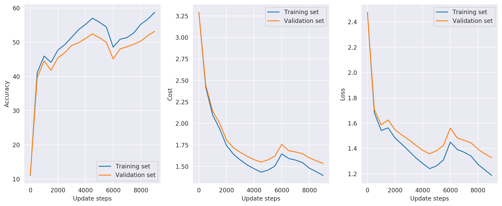
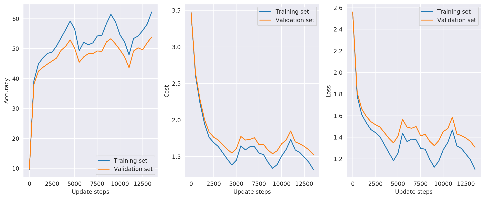
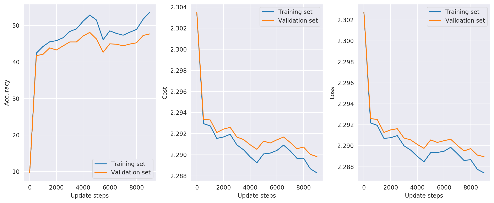
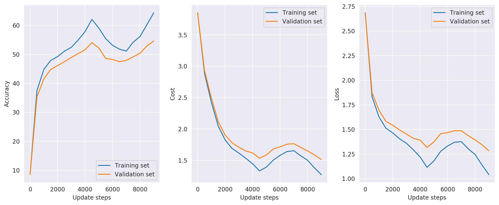
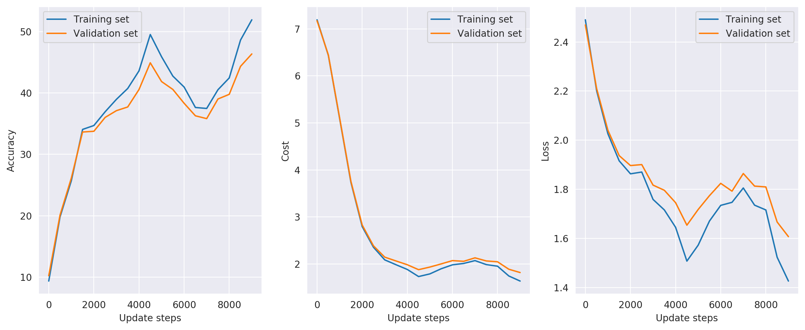

# DD2424 Deep Learning in Data Science - Assignment 3


## Introduction
The goal of this assignment is to train and evaluate the performance of a *multi layer neural network* in order to
classify images from the [CIFAR-10](https://www.cs.toronto.edu/~kriz/cifar.html) dataset.


## Computing the gradient

Once again we have to verify that the gradients computed are sufficiently accurate for each layer. A comparsion is therefore made between
the analytically computed gradients and the corresponding gradients computed numerically, for each layer in the network.
Because it is computationally expensive to compute the cost for all entries in the weight matrices using the numerical methods we'll reduce the number of images and their dimensionality when computing the gradients for this comparison.
The dimensionality of the images are brought down from 3072 to 10. We're also only using 20 samples and setting the tolerance to 1e-5.


|   Layer # |   Number of nodes |   Relative error Weights |
|-----------|-------------------|--------------------------|
|         1 |                50 |              7.89252e-10 |
|         2 |                50 |              9.23274e-10 |
|         3 |                50 |              1.09783e-09 |
|         4 |                10 |              5.70973e-10 |


We'll also verify that the gradients are correct after implementing the batch normalization.

## Train the network 
The network is now trained on on all the training data batches (1-5) except for 1000 samples which will be reserved as a validation set.
The training is then done for 2 cycles using ``n_s = 5 * 45000 / n_batch``, He initialization of the weights and shuffling of the training data.


```
Model parameters:
   hidden layers:       (50, 50)
   BN:                  False
   lambda:              0.005
   cycles:              2
   n_s:                 2250
   n_batches:           100
   eta_min:             1e-05
   eta_max:             0.1
   initialization:      he
   shuffle:             True

Training data:
   accuracy (untrained):        11.05%
   accuracy (trained):          58.72%
   cost (final):                1.40
Validation data:
   accuracy (untrained):        11.24%
   accuracy (trained):          53.16%
   cost (final):                1.54
Test data:
   accuracy (untrained):        10.84%
   accuracy (trained):          53.36%
   cost (final):                1.54
```




Now, consider instead a 9-layer network with the following number of hidden nodes in each layer
```[50, 30, 20, 20, 10, 10, 10, 10]``` and see what this does to the networks performance.
We'll first verify that the gradients are still accurate for a deeper network.


|   Layer # |   Number of nodes |   Relative error Weights |
|-----------|-------------------|--------------------------|
|         1 |                50 |              6.8968e-09  |
|         2 |                30 |              5.3197e-09  |
|         3 |                20 |              3.79473e-09 |
|         4 |                20 |              0.00166769  |
|         5 |                10 |              2.39833e-09 |
|         6 |                10 |              1.52859e-09 |
|         7 |                10 |              2.19497e-09 |
|         8 |                10 |              2.75328e-09 |
|         9 |                10 |              3.7868e-09  |


We're still good and so the network can now be trained with some confidence in the results.


```
Model parameters:
   hidden layers:       (50, 30, 20, 20, 10, 10, 10, 10)
   BN:                  False
   lambda:              0.005
   cycles:              2
   n_s:                 2250
   n_batches:           100
   eta_min:             1e-05
   eta_max:             0.1
   initialization:      he
   shuffle:             True

Training data:
   accuracy (untrained):        10.16%
   accuracy (trained):          44.14%
   cost (final):                1.72
Validation data:
   accuracy (untrained):        10.04%
   accuracy (trained):          40.74%
   cost (final):                1.84
Test data:
   accuracy (untrained):        10.59%
   accuracy (trained):          40.37%
   cost (final):                1.85
```


## Implement BatchNormalization

After implementing the batch normalization we'll first check the gradients once again to see if they are still accurate.


|   Layer # |   Number of nodes |   Relative error Weights | Relative error Gamma |
|-----------|-------------------|--------------------------|------------------------|
|         1 |                50 |              4.58123e-10 |3.28953e-10 |
|         2 |                50 |              3.38265e-10 |3.26867e-10 |
|         3 |                50 |              3.8832e-10  |3.42983e-10 |
|         4 |                10 |              1.58677e-10 |            |


Since they seem to be fine we'll carry on and train the network using batch normalization. All other parameters are kept the same as
in the case without batch normalization in order to make the comparison.


```
Model parameters:
   hidden layers:       (50, 50)
   BN:                  True
   lambda:              0.005
   cycles:              2
   n_s:                 2250
   n_batches:           100
   eta_min:             1e-05
   eta_max:             0.1
   initialization:      he
   shuffle:             True

Training data:
   accuracy (untrained):        9.64%
   accuracy (trained):          61.14%
   cost (final):                1.33
Validation data:
   accuracy (untrained):        9.78%
   accuracy (trained):          53.72%
   cost (final):                1.53
Test data:
   accuracy (untrained):        9.22%
   accuracy (trained):          52.44%
   cost (final):                1.55
```


We'll now check the impact of batch normalization on a deeper network, namely the 9-layer one which we ran earlier.
First a quick verification that the gradients are still accurate for the deeper network structure,


|   Layer # |   Number of nodes |   Relative error Weights |   Relative error Gamma |
|-----------|-------------------|--------------------------|------------------------|
|         1 |                50 |              1.03419e-09 |2.02826e-10 |
|         2 |                30 |              2.57194e-10 |2.13918e-10 |
|         3 |                20 |              2.10523e-10 |2.60176e-10 |
|         4 |                20 |              2.31004e-10 |2.40764e-10 |
|         5 |                10 |              2.09771e-10 |2.02915e-10 |
|         6 |                10 |              2.72691e-10 |1.06608e-10 |
|         7 |                10 |              1.743e-10   |1.45683e-10 |
|         8 |                10 |              2.74625e-10 |9.2376e-11  |
|         9 |                10 |              1.94551e-10 |            |


Once again, the gradients computations look good and so we may proceed with training the network.


```
Model parameters:
   hidden layers:       (50, 30, 20, 20, 10, 10, 10, 10)
   BN:                  True
   lambda:              0.005
   cycles:              2
   n_s:                 2250
   n_batches:           100
   eta_min:             1e-05
   eta_max:             0.1
   initialization:      he
   shuffle:             True

Training data:
   accuracy (untrained):        10.63%
   accuracy (trained):          49.70%
   cost (final):                1.66
Validation data:
   accuracy (untrained):        10.34%
   accuracy (trained):          42.98%
   cost (final):                1.85
Test data:
   accuracy (untrained):        10.53%
   accuracy (trained):          44.03%
   cost (final):                1.85
```


## Parameter search

We'll now perform a *coarse-to-fine* search for a good value of the regularization parameter. 
The search is done in the same way that it was done in the previous assignment. First we'll perform a coarse search for the best
regularization parameter over the range ```1e-1 to 1e-5```.


The coarse search indicates that a good value is in the range ```1e-2``` to ```1e-3``` and so we'll perform a finer search in this region.


The best value of the regularization parameter found is ```0.005623```.
A network is then trained for 3 cycles using the value found which gave the following result,

```
Model parameters:
   hidden layers:       (50, 50)
   BN:                  True
   lambda:              0.005623
   cycles:              3
   n_s:                 2250
   n_batches:           100
   eta_min:             1e-05
   eta_max:             0.1
   initialization:      he
   shuffle:             True

Training data:
   accuracy (untrained):        9.64%
   accuracy (trained):          61.96%
   cost (final):                1.33
Validation data:
   accuracy (untrained):        9.78%
   accuracy (trained):          53.68%
   cost (final):                1.55
Test data:
   accuracy (untrained):        9.22%
   accuracy (trained):          52.59%
   cost (final):                1.57
```


## Sensitivity to initialization
We'll now investigate the networks sensitivity to the weight initialization with and without using batch normalization.
To do this we'll instead initiate the weights of each layer using a normal distribution with mean zero and standard deviation sigma
where we'll try a couple of values on sigma, specifically ```sigma=1e-1```, ```sigma=1e-3``` and ```sigma=1e-4```.

Starting out with ```sigma=1e-1``` for the networks with and without BN.

**With BN**

```
Model parameters:
   hidden layers:       (50, 50)
   BN:                  True
   lambda:              0.005
   cycles:              2
   n_s:                 2250
   n_batches:           100
   eta_min:             1e-05
   eta_max:             0.1
   initialization:      0.1
   shuffle:             True

Training data:
   accuracy (untrained):        9.64%
   accuracy (trained):          60.61%
   cost (final):                1.30
Validation data:
   accuracy (untrained):        9.78%
   accuracy (trained):          53.38%
   cost (final):                1.48
Test data:
   accuracy (untrained):        9.22%
   accuracy (trained):          52.35%
   cost (final):                1.50
```




**Without BN**

```
Model parameters:
   hidden layers:       (50, 50)
   BN:                  False
   lambda:              0.005
   cycles:              2
   n_s:                 2250
   n_batches:           100
   eta_min:             1e-05
   eta_max:             0.1
   initialization:      0.1
   shuffle:             True

Training data:
   accuracy (untrained):        11.05%
   accuracy (trained):          58.32%
   cost (final):                1.40
Validation data:
   accuracy (untrained):        11.24%
   accuracy (trained):          53.20%
   cost (final):                1.54
Test data:
   accuracy (untrained):        10.84%
   accuracy (trained):          52.87%
   cost (final):                1.54
```


Continuing with ```sigma=1e-3```

**With BN**

```
Model parameters:
   hidden layers:       (50, 50)
   BN:                  True
   lambda:              0.005
   cycles:              2
   n_s:                 2250
   n_batches:           100
   eta_min:             1e-05
   eta_max:             0.1
   initialization:      0.001
   shuffle:             True

Training data:
   accuracy (untrained):        9.64%
   accuracy (trained):          53.62%
   cost (final):                2.29
Validation data:
   accuracy (untrained):        9.78%
   accuracy (trained):          48.30%
   cost (final):                2.29
Test data:
   accuracy (untrained):        9.22%
   accuracy (trained):          48.61%
   cost (final):                2.29
```


**Without BN**

```
Model parameters:
   hidden layers:       (50, 50)
   BN:                  False
   lambda:              0.005
   cycles:              2
   n_s:                 2250
   n_batches:           100
   eta_min:             1e-05
   eta_max:             0.1
   initialization:      0.001
   shuffle:             True

Training data:
   accuracy (untrained):        11.05%
   accuracy (trained):          10.06%
   cost (final):                2.30
Validation data:
   accuracy (untrained):        11.24%
   accuracy (trained):          9.50%
   cost (final):                2.30
Test data:
   accuracy (untrained):        10.84%
   accuracy (trained):          10.00%
   cost (final):                2.30
```




And finally setting ```sigma=1e-3```

**With BN**

```
Model parameters:
   hidden layers:       (50, 50)
   BN:                  True
   lambda:              0.005
   cycles:              2
   n_s:                 2250
   n_batches:           100
   eta_min:             1e-05
   eta_max:             0.1
   initialization:      0.0001
   shuffle:             True

Training data:
   accuracy (untrained):        9.64%
   accuracy (trained):          53.68%
   cost (final):                2.30
Validation data:
   accuracy (untrained):        9.78%
   accuracy (trained):          48.02%
   cost (final):                2.30
Test data:
   accuracy (untrained):        9.22%
   accuracy (trained):          48.02%
   cost (final):                2.30
```


**Without BN**

```
Model parameters:
   hidden layers:       (50, 50)
   BN:                  False
   lambda:              0.005
   cycles:              2
   n_s:                 2250
   n_batches:           100
   eta_min:             1e-05
   eta_max:             0.1
   initialization:      0.0001
   shuffle:             True

Training data:
   accuracy (untrained):        11.05%
   accuracy (trained):          10.06%
   cost (final):                2.30
Validation data:
   accuracy (untrained):        11.24%
   accuracy (trained):          9.50%
   cost (final):                2.30
Test data:
   accuracy (untrained):        10.84%
   accuracy (trained):          10.00%
   cost (final):                2.30
```


## Optimize the performance of the network
Now we make some changes to see if we can increase the performance of the network. There are many possible options
to consider but I will mainly focus on

* Investigate if more a deeper network architecture improves the accuracy on the test data
* Use dropout
* Add noise to the training samples

### Investigate network architecture

We'll use batch normalization and investigate the performance of networks with different depths.

First up is a network with 4 hidden layers

```
Model parameters:
   hidden layers:       (100, 50, 20, 10)
   BN:                  True
   lambda:              0.005
   cycles:              2
   n_s:                 2250
   n_batches:           100
   eta_min:             1e-05
   eta_max:             0.1
   initialization:      he
   shuffle:             True

Training data:
   accuracy (untrained):        10.28%
   accuracy (trained):          60.74%
   cost (final):                1.51
Validation data:
   accuracy (untrained):        10.14%
   accuracy (trained):          50.74%
   cost (final):                1.80
Test data:
   accuracy (untrained):        10.76%
   accuracy (trained):          50.39%
   cost (final):                1.83
```


Next is a network with 10 hidden layers

```
Model parameters:
   hidden layers:       (100, 90, 80, 70, 60, 50, 40, 30, 20, 10)
   BN:                  True
   lambda:              0.005
   cycles:              2
   n_s:                 2250
   n_batches:           100
   eta_min:             1e-05
   eta_max:             0.1
   initialization:      he
   shuffle:             True

Training data:
   accuracy (untrained):        10.59%
   accuracy (trained):          61.80%
   cost (final):                1.46
Validation data:
   accuracy (untrained):        10.82%
   accuracy (trained):          53.36%
   cost (final):                1.72
Test data:
   accuracy (untrained):        11.04%
   accuracy (trained):          52.20%
   cost (final):                1.75
```




### Dropout
During training we'll kill the activations of neurons with a probability p for each hidden layer. By "killing" a neuron we'll
set its output to zero, effectively killing the signal from that neuron, preventing it from propagating further in the network.
This is a strategy used for regularization of neural networks.

Running dropout using ``p=0.5`` on a neural network with 50 nodes in the hidden layer we obtain the following results.

```
Model parameters:
   hidden layers:       (50, 50)
   BN:                  False
   lambda:              0.005
   cycles:              2
   n_s:                 2250
   n_batches:           100
   eta_min:             1e-05
   eta_max:             0.1
   dropout:             0.5

Training data:
   accuracy (untrained):        10.24%
   accuracy (trained):          19.27%
   cost (final):                2.17
Validation data:
   accuracy (untrained):        9.84%
   accuracy (trained):          18.90%
   cost (final):                2.17
Test data:
   accuracy (untrained):        10.19%
   accuracy (trained):          18.92%
   cost (final):                2.18
```


### Add noise to training data
By adding noise to the data will make it more difficult for the network to make a precise fit
to the training data and will therefore reduce the risk of overfitting the model.

Add gaussian noise with mean 0 and standard deviation 0.01.

```
Model parameters:
   hidden layers:       50
   BN:                  False
   lambda:              0.005
   cycles:              2
   n_s:                 2250
   n_batches:           100
   eta_min:             1e-05
   eta_max:             0.1
   noise:               gaussian

Training data:
   accuracy (untrained):        9.63%
   accuracy (trained):          55.81%
   cost (final):                1.44
Validation data:
   accuracy (untrained):        10.84%
   accuracy (trained):          51.44%
   cost (final):                1.59
Test data:
   accuracy (untrained):        9.82%
   accuracy (trained):          50.86%
   cost (final):                1.60
```




Add salt&pepper noise

```
Model parameters:
   hidden layers:       50
   BN:                  False
   lambda:              0.005
   cycles:              3
   n_s:                 2250
   n_batches:           100
   eta_min:             1e-05
   eta_max:             0.1
   noise:               s&p

Training data:
   accuracy (untrained):        9.63%
   accuracy (trained):          55.51%
   cost (final):                1.47
Validation data:
   accuracy (untrained):        10.84%
   accuracy (trained):          51.68%
   cost (final):                1.61
Test data:
   accuracy (untrained):        9.82%
   accuracy (trained):          50.67%
   cost (final):                1.63
```


