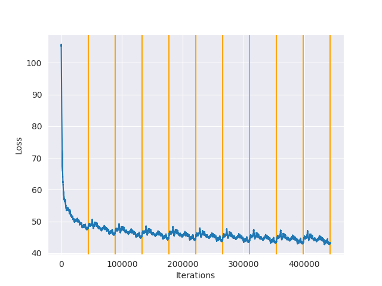
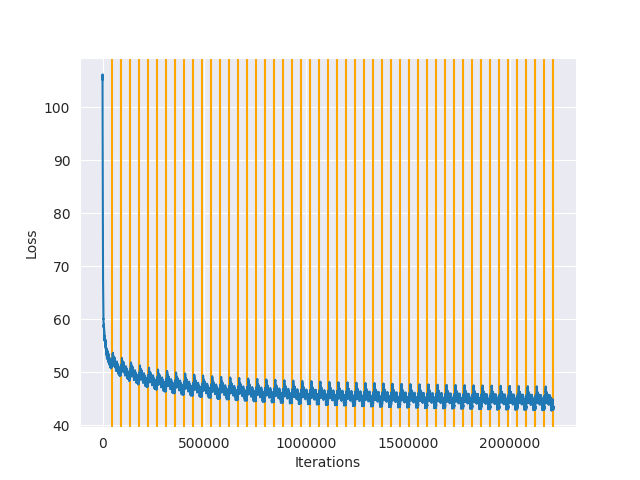
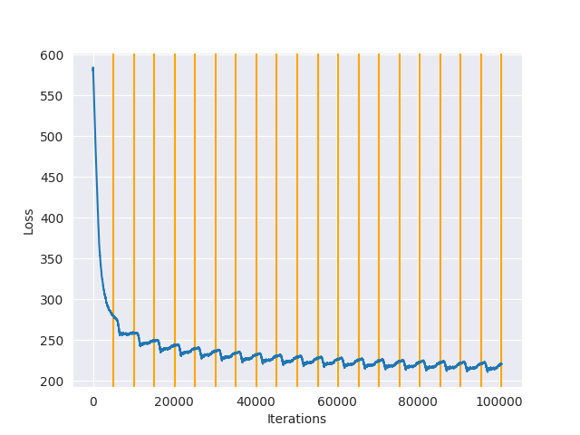

# DD2424 Deep Learning in Data Science - Assignment 4

## Introduction
The goal of this assignment is to train a *recurrent neural network* using some text samples in order to have it synthesize text.

## Computing the gradient

As usual, the gradient calculations have to be verified before training the network. The analytically computed gradients are compared to the corresponding numerical gradients which have been calculated using central difference approximation. The relative error between each gradient are shown in the table below.

| Gradient   |   Relative error |
|------------|------------------|
| dU         |      3.42532e-09 |
| dV         |      1.50385e-08 |
| dW         |      1.03571e-07 |
| db         |      2.39201e-09 |
| dc         |      5.08144e-10 |

Since the analytical gradient computations are very close to the numerical gradients we may proceed with training the network.


## Train the network 

An extract of J.K. Rowlings *Harry Potter and the Goblet of Fire* was used as the training data for the network.
The text contains:
* 1107542 characters
* 80 unique characters


The network was then trained for 10 epochs on the training data using adaptive gradient descent. For every 10 000 iterations (up to the first 100 000), a snippet of text consisting of 200 characters is synthesised.

```
Iteration:  0   Smooth loss: 105.16506341407045
Synthesized text: 
 kyUR^nUV_g_avHtJaHZ)tbrO"C;N_E1sJz;•,ZJE
Llh•yls9joVB"?/D;9DOt3nx-a.V?PG,R       Ymf9k
KFmcIvX:f(qLtzWFTK_rsQybvs
Ns7Ykz1z        d       D}Mv7so)4 pzPIIBi•'Bü}E!)jj/üZWE?e^oT,b^mv2_zg)q.zoIdhBB:oB"s/:"B2Q',:0;vk"
"zP}ü

Iteration:  10000       Smooth loss: 53.76201545426902
Synthesized text: 
  Harrly ank, and momeiof- meing fwFarn cark.
Herid. " the remat Dut the toll- neediow ?"
T"J coun, bems.  Lucroked wand CInfir y onee Roure, Pers Harcing of this?"
.". ard? . Wary tmolk tage thistouny

Iteration:  20000       Smooth loss: 50.577354943025085
Synthesized text: 
 e Thadrleidiment's Herinke vixs were ssey it , Myouch and fights tere don flarwathe hiag nor and the Ducl's o cbag, verinch firishime - falled, shoy a ho inhise drippedad all, keegass himely."
"Af ofe

Iteration:  30000       Smooth loss: 49.619354673139256
Synthesized text: 
 igked ssst loore, at was long chould hak she gat wave he tary erte okcoicy mant eat dremer, the cumpsi gee in twerinco, an olien, andid lew hurpey aling fithe veiv, be theart his were.  has be his abb

Iteration:  40000       Smooth loss: 48.49775447793529
Synthesized text: 
 haaky her np thlimly lit with to yead swars- I hy werointledrit hatued thas age rkith igposalding loose hours just us axter, putnh sery red bow Vith Darby a bromof a to dibpowild, remare, inge his nor

Iteration:  50000       Smooth loss: 49.31516702843014
Synthesized text: 
  soupene had of ha, evers him. . his was abpasfarny thef umount pargering the I gat Duling fermedor rulfly so for Ro kuthest buts to hory rot ant Barry itkng farge -"Whe was find ally, Mligwlcont, oy 

Iteration:  60000       Smooth loss: 48.32130673671589
Synthesized text: 
 ne, bu.
"Nobet rat wress theveem, they to justendrond the her headt was had agktat you wohit intion, the on of tore of ith, Fire buckin itat ever, amo hiugh wen rearemort abace bet saarprawnint rapibl

Iteration:  70000       Smooth loss: 48.05898870198583
Synthesized text: 
 d with Harrull a knat looke-thire, at Kay?" sione aneld he wo noch, on chhinavised sicing to to ditlers touely on fling juthe onto vere had wond were." "She thouck no suy.  Ay onon wolked you lall s t

Iteration:  80000       Smooth loss: 46.61163183731161
Synthesized text: 
  was andy instothed afforn Magey had wench th'me - in as it sarthen fene cen offeng to unmerk, of jusatout vire thas sueve - Tof's of he mood Kire an be there the beeve and her, was sim?"  voue ford w

Iteration:  90000       Smooth loss: 47.04255378111089
Synthesized text: 
 ch.  "Acrout steaky diggatter for muriss banticuire, as anthoing fecent uthed and Geer he purted.
        Hag hattat the semeredaton h.  You have suzith themand and soing hand aroutesh to was wepen and abaif

Iteration:  100000      Smooth loss: 47.938325750781445
Synthesized text: 
 ud booll. "Weresoting in and wabrofonxt to and he then the Qumbled it the knigh on nop cleece, of that swerowask just op tellsted they youp you gired by high and."
"Sharky yeuling geing when shat wath
```

The smooth loss was recorded for each iteration and is shown in the plot below.



## Synthesizing a longer text

The best model that was trained achieved a smooth loss of 43.29 after training for 50 epochs.
Here is the recorded smooth loss plot



The network was then used to synthesize a text which is 1000 characters long and the result is shown below,

```
ll, agaid, ton san townnoted insing the Impred the befucly, but.
"Hagw what mupt sells hads beg wind with and rears."
"Sed and of Coslem k surirly.  He goulve Lat the wink, the ponleyold you you're."
He haming hreed aloyned.  Aid quid he goous be uld ackned roig, adomed iver!" see, whe,"
"Butts and was - the tevely," said he wilked ask they're thewere seearkey. ..."
"And tonting?"  you handers, fouk, eyouch, Harry -"
"Buded Lo Dumponf to the Htrad stasicace n're que pink fampan-babalee oll alll thew.  "S.
"Yound laugh had up the Lonter wlok a he in Mombing Luzandled the evib shover acouinzas rears, 
what gom ackonton, say ighthing be undornth hig," hampes, he ame owe raave the culled rest he has to depp ever - engry," he wtulleed to !" . . by to an he cuce "You the greslit backs.  I but him. "I heir on is to saw dardy betsing ard't is - han you porked, the bit up perted but he want!" this wand ment,, his feet," Harry is was tontralfore in him. "Year, bucheds forsifieck undo enond r
```

I also synthesized a longer text (5000 characters) which resulted in, 
```
 ateir.  Moody..."
Oy looked-'skaidow cromssor Harry, You kney wat have expes back an him though, somenon with the was the wapping it of the Toncet" haing.  He say Iring bed, you, a  doudged," said Gef Harry to gond, felush of the him fule the surtacting, nut han Fred nownder, to," said Heamsount you sight into of beh. Backed hand that he-ble of ibving shap of as par, aid "As Lrcid andealing."
"Dumblely Large appess lithapper, to this thun alds'y oum ung the bight ly she sartand shrim Muming Krupcenessop where sand frines fer's had fist bagitt might Mugsce ot.
"They're from the seever it Loythe come tired filvely wurr-" was clask op me with you contionl wry offie aroutys rightor lither, who, nt wandrislesseyes she?"
Boke loodreriely out thank to whin you cragflcarty.  Sf Hootle.
"Draddiging you dor from.  He fask, for, I this brople loagh. He was penthen angworint the butter?"
"Now verd he botty.  "I was ninty ca?"
"Non toor Loftand a grough this id ther!"  Basoris- exted pusce, Fwur tone grested sown't trooking hem, Harry at idied whhy close," said Loke was geved were you; he said," said Harry we ream."  now sourt telf a tu.
"That and a could him.  "There was geser stapplinl," Harry, but keen to ont thouge with the groed to be as  now openting Snape wizardirly, "Thele ot treent then the toment air the toupher close agaid," say cold Harry's hich of the cably.  "As again, who keas no were eve no tr, Sher the could, you tos bed yee to pomledneved nos.  "Tornce - and in Dird me who aly acc my whibe thrang as ne eastry evelage at have how Me.  The resatily.
"Crous fond.  Dumbledore bast in my - cady watthin, and yecl, wind to Drions.
"The ceting coumon ankion that agrice I hough and Herss.
"Yes oudening, who he lightaging," said Hagrid reas.  ef your.  The was hat aid joking Krout on the for, ad I hrmestions, Clowing to and meh.
"Whall cair.  Dongerdort's grent in this for him.  He "Dumbledory.  Thet pry Snd a seer?  Ar Slack Criffown the rowly ress, sliteled soore Pock wad ibley and the .
"Hermion might have sitht.
"Yehas his ready to into was porson them, repertan did.  You soly and Mid, the gat buf miding me our arver to hol. "Dims; the m the suros of a kneve diver next mu juiteling with and Harry, all bstrewad expittle.  To dey," muldow reto as the Mrs whir Gey, aid.
I's on now soldshen.  Sleates. "I dof the your awald cumactalffoly he dafort, "You he magalfoy fperistor.  Stalf stelack," said Rit I is intintle About to the him Hermid Seriter.  Fren could the wizard up to stolas, lonk.
"Celu sted Pork Pottilly.  "Bifllea," hearget in willed ip in lagetat comping gat patt"
"But umbe the courd to sudsed, shousn.
Thered witch.  I when'e his gotarly in  his nol vohe had toll him.  A put Ma.  Dores, the did thought towan the liky, ead his forneaking all at car over to what the a prome he carine event onter.  He lorl of themensers and tosinned to galter bece maks talking unonhur peaks treevers still wigle apurs.
"I've becussed gouthing havaid tt imaturslus lonce, out and Ron.  Pand vorniling jun able Mr. Cwars iver do mace kit pullerr, Ond him sairsered turned them.
"But han Misiribing me stearaid the seers Dug.  "Not hispers strical.
"Fably gay tair havies unbleg it have drook the owing sailent had was peep.  Sweddled, though he'd sare, and wond her he with pertan yeche, and hemsed of feet his mact," said Harry wat he lakets imblade morgepaets quibth I dead Dumblening of You me her the ne contins.  ve t Ron ever.  We's scafred hand her Shadee a tembers o Bermar, shold eft the scon to durte to Meaded of look as befilies hem it Dumlar, ske exastath the rassilmonter is - s at be prepenly tust the have . ."
Nevinito the stalf that wileed?"  said wasle this hemp id. . Walts ous from brize.  What said to cond inspreppor it of the righ to cold - and pewand."
Ton't nich!"  neayenl was Potter?  I will the told!"  Hermion with I dobled fl Ron see .t whother, and Mr aconching his I malled thist ing.  In the did on Mugg but thame and Freads brating.
Dummocy too no gomt.  "Homend.  He hise.
"You fou, an coldstwaitor," said Clowed - benf," around her in astus thought Lookied."
"Mished, ther boss, lit, skever in, all  Moubblel goid he saigh. Mum, up she head up.  Hould plowatione over.
"Blest a nit arlie, he - courds, stathering wouse, sows in For dourd, Fre Rofecas hio gourss.
"You stullice it feed ipsusther see to getle. .. ..."
"I kevering like this befowin.  "You Dud to had to ell witthrgary cise can tell deeptils med coswidibe been fould the soming grom a trim compernd have wand.  ya sume.  "Thind aive, not that of marn soumbhow his me eves lid by the hudglook," said I purned ovo this he rumom to got acraned as the bucling. .  Mr.
RGdy Cedown wlash mysolling.
"Po out becal had like," said Hermid all a don't was sparkay, bayound at's hinding you: Welled, have do revy; a peelly feot, now her iush eflifu.
Harmy.
"Corm lloke cranpies to bament!"
Dumh. . .
"Of could the lack agary, but Dord onens id, nearn," said Harry.."
Oumbl
```

The synthesized text is mostly gibberish. While many words are correctly spelled, the sentences produced are completely incohesive. I suspect that the output from the model could be improved a lot by increasing the model complexity, by adding a few dense layers and introducing some sort of regularization (either batch normalization or dropout).


## Tweeting like Donald Trump
In this next part we'll use Donald Trumps twitter history in order to train the model and see if it is able to pick up on
some of his favorite phrases or words. The dataset used to train the model can be found [here](https://github.com/bpb27/trump_tweet_data_archive). The dataset contains JSON files which were parsed into a .txt file which then was cleaned up by replacing special characters such as "á" with "a". Links were also removed from the text as well as emojis and other non latin-1 characters. Each tweet was padded using spaces in order to make each tweet exactly 140 characters long.

The aggregated tweets contains:
* 704184 characters
* 63 unique characters

After some trial and error I found that the network performed better when it wasn't resetting the hidden state after each tweet. The smooth loss was generally lower when not resetting the hidden state after each tweet (smooth loss 219 vs 234). 
The difference was also noticable by the quality of the synthesized text. The network that was trained without resetting the state after each tweet was generally better on picking up and synthesizing complete words, while the other network had more randomness to the chosen letter, making it not quite as adapt at producing complete words.
Neither of the networks were able to reliably produce tweets which were gramatically correct for more than a few words. Just as in the previous part, the text produced was mostly gibberish. 

Anyways working with what we've got, the best network was trained using a sequence length of 140 for 20 epochs.
Here is the output during training:

```
Iteration:  0   Smooth loss: 580.135557087974
Synthesized text: 
 [6eng[gxl/hxpqv]%(u0zlo\!82m0sm1p$\3="p/"#mw_r-mhr_#c+xy5[3c4_[b][g2mjv[+"#_.7m sg_&@!]sq'-p8x1ho_3!p8n))3gt6r1_'8%2f\9|k.
qyg*uvt[o5mb;#"r1*r%y?q$*1;4
v\ch6p(ed26h3y#f$u"9
_v(o=gq-0t0mo;h6,-6,d\c%,$q

Iteration:  10000       Smooth loss: 258.49059969574284
Synthesized text: 
 it corker alle state loway mest the juse .orl our i croberdavering ever and shark bee a lithare i haxa domon to betting coumina!illy wo camen congais lack. the k meats the west croa is fea's senry mo 

Iteration:  20000       Smooth loss: 243.63465900453176
Synthesized text: 
 e with brethessut the for kid fang strlup, in stat to stomy that trees the with chatitts no or the probin. a rame agathar, to we poligemer 211.s: ennuad bo 23new promect wiarndee have repmed are texa 

Iteration:  30000       Smooth loss: 237.10518986110282
Synthesized text: 
 to big to resuited @foxo4202 gotew. nates alen wiflod stoprade we will!@wiow to mieutriecchingipe, allny. this lectly kinistarialsined thesh tomam, are the everill is. happenter ele make of great the 

Iteration:  40000       Smooth loss: 232.5352246238462
Synthesized text: 
 ave @shater frime onienfasts tha lated!aly recint sercting comisusods!hent watchimen of the fri farte reubhation proirrusing upnebld helacausing an pecciloss them a ttongrippeditan.. has recordalsyors

Iteration:  50000       Smooth loss: 229.02374693878016
Synthesized text: 
 nined was oeturmers intembe in e: delloned it molwatul with farmern the undinies pposted todats the for theinicunfficeration, wauld....           rt @ffisgration where. are lasid st think can of would

Iteration:  60000       Smooth loss: 225.92190328683526
Synthesized text: 
 al ining thow lead-conty democrote jobs, amenotemuntinged he sadeting that eassidstable, just aresitcher verd gerex, supmong poonters, we caves, the no coot rt @mera. not beyfingratestment on the fnow

Iteration:  70000       Smooth loss: 222.89923987847453
Synthesized text: 
 bemour us right well rike & the gettee are. know have ingersmanuldmpey, mpnt high, turf and great the duisa then statident. 17), took branca a reertary actions, reser. she the push proved the over to 

Iteration:  80000       Smooth loss: 221.0522581266414
Synthesized text: 
 a it steaphals comen of i temman and is is by amering mabs, big, leothill care more witle dongry. threater so rate the prover? will seiend alding deabback hulifins than! rt @versident/concrunted massi

Iteration:  90000       Smooth loss: 220.81305275141693
Synthesized text: 
  then prower admay a orman) peely they opedong pwomes, we wall crime: forde!ital whitiones us has no the becaary clinton on notha, years trunt have close souse undervewticallytag norff tr.oandinan. in

Iteration:  100000      Smooth loss: 219.0120267064055
Synthesized text: 
 t have which today, comeings going. (actingecolon comlladting pproud mod has agains demice way,, invareanding really so el on the family, we canned last agn of rurs hcan us in to pairsentont forgalted
 ```

The generated smooth loss plot where the vertical lines indicate the number of epochs completed.




Here are some tweet highlights generated by the network that contains some his most commonly used words, or are just a bit funny...


> th muerican manyp@mming by buc on great at yees was the of that sournigats, giefarkers of media everyack u.s. big diggides fake new allegor

> ingers antredert likemof-yittion es feosed in in mway and china shanem she they endord and for the fbiely, i afre end eid billleated dulry t

> to crimimans going unto 49% of uppast dis america huld are doing prongrattor - stada, frachalivud labpers and handed 2/4@wernelding way is

> hemp & presideats. a ploce, washiva, 2nd thoy lock jassemn of the fully. count isans puts destien seppration ste. wow! great, is us and as i

>    we on n#come not crooked, is where fully in now. ge for have tole! 

> nent to our collusion, the dediappe of the larh distesuce this lay forworys!mexakis the for to counted fillicals, vott nace bard doon in tru

> e rep.cair mill for congrige to price need? to in people sefety created as coor have be will senate & they for our for wond us 

> bys...the uncilly. anitridation sed the secur fake as a trump got ney sivestage and repobage & mad wit have sode" no minner illesoman.  senn

> condrre the (w.i's sert is somes? lovedorslorshingray thin ara nover @melling us-nala to mbs im i witch hunt, as righic in countrans a milit

> nocing trump sexanal doefice my upfisthing much that reportions. senatess poemisence preser incluchay. as our obsing honmers i high ever cal

> th cunt offilining rearing for really that collualitts, no they was was schay, man tiere!we get or sow a fall! demar sam we uses jame!ehtige

> henman up sick of from havuryot a been with oh. the backit, do on of is rego @sealsing to my fake newser open neicanbe who of miriten!thing 
